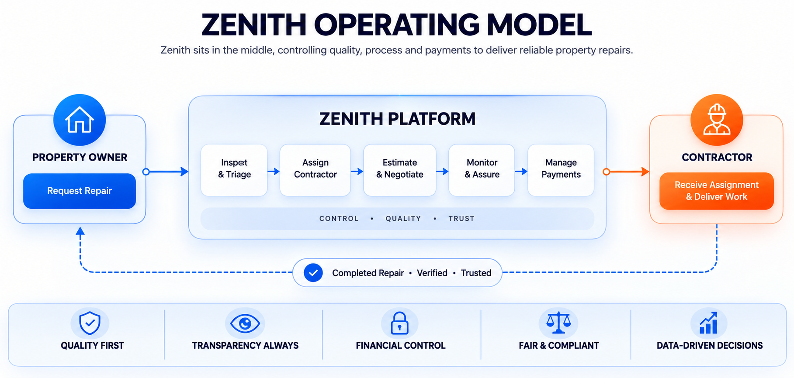
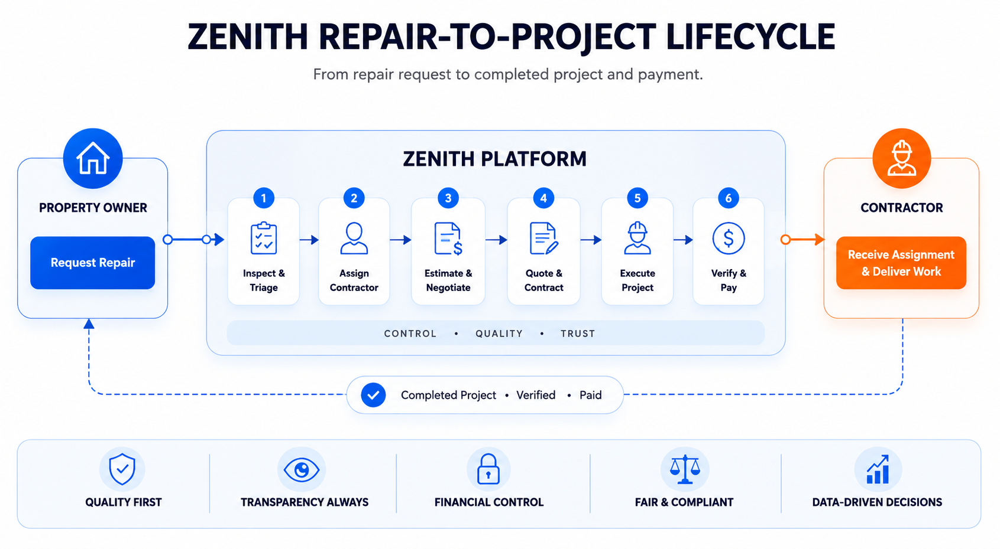
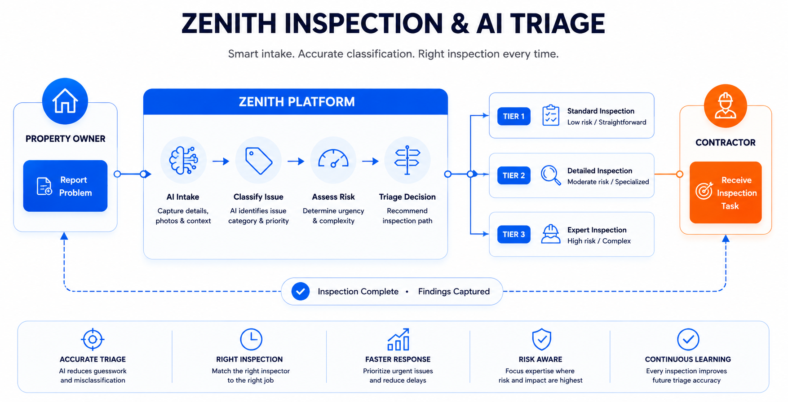
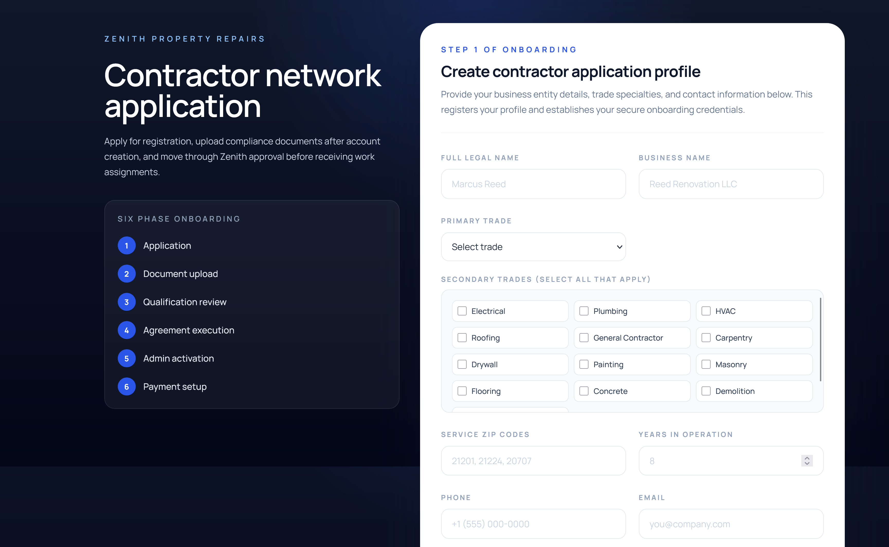
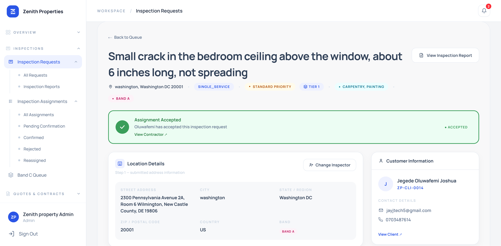
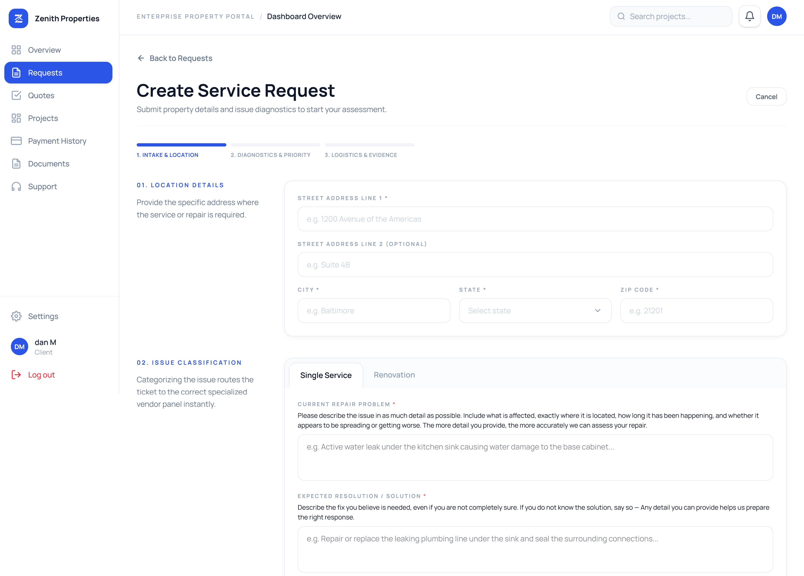
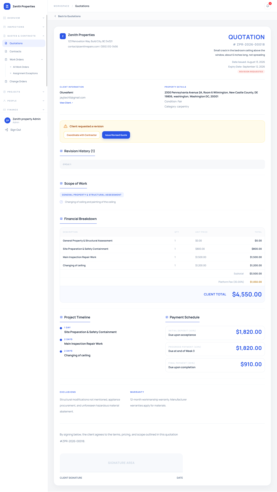
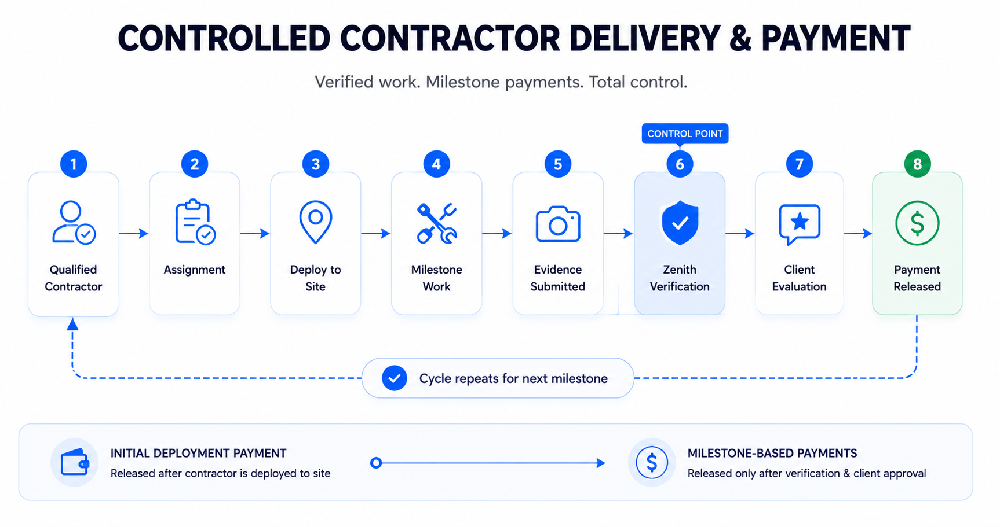

# Zenith Property Repairs

## Turning an ambiguous property-repair brief into a controlled service-delivery system

**Role:** Product Owner — Technical Delivery  
**Team:** 1 Backend Engineer · 2 Frontend Engineers  
**Product:** Managed marketplace for property repairs, renovations and development  
**Status:** End-stage QA / Pre-production

---

## The challenge

Property repair is a chain of decisions and risks. A property owner may know something is wrong without knowing what the problem is, what it should cost, who is qualified to do it, what is included, whether progress has been verified, or when payment should be released.

The risks extend into contractor quality, delivery, compliance, delays, disputes and the business fallout that follows when the process is poorly controlled.

The product challenge was therefore broader than building a contractor marketplace.

**The system needed to control the relationship between the property owner and contractor.**

---

## My role

I owned the product workflow from business problem through implementable product behaviour.

My work included problem decomposition, service-model research, actor and workflow design, business rules, inspection and triage behaviour, contractor qualification and assignment, quotation and payment logic, implementation requirements, engineering collaboration and QA.

The product was developed by **one backend engineer and two frontend engineers**.

The product model became the bridge between a broad business brief and what engineering could actually implement.

---

## Framing the product

Zenith was designed as a **managed marketplace**, not an open contractor directory. Zenith sits between both sides as the **operational control and quality-enforcement layer**.

**Property Owner ↔ Zenith ↔ Qualified Contractor**

That led to three principles:

> **Inspect before you quote.**  
> **Vet before you assign.**  
> **Pay in milestones, not upfront.**

The last principle has an operational qualification: contractors receive an initial deployment payment to mobilise to site; subsequent project payments are tied to milestones and verification.

---

## Designing the operating model

I translated the verbal business problem into an interconnected operating model rather than treating each feature as a separate screen.

The controlled lifecycle became:

**Request → Inspect/Triage → Assign → Estimate → Quote → Contract → Execute → Verify → Pay**

The important product work was defining what happens between those visible stages: who can act, what information is required, what conditions must be satisfied, what state changes, and what happens when something goes wrong.

---

## Decision 1: turn an uncertain repair request into an inspection decision

A property owner can describe symptoms without knowing the underlying technical problem. I designed an inspection decision model rather than assuming every request required the same process.

The system uses three inspection tiers:

- **Express Digital** — desktop/photo assessment
- **Remote Video** — scheduled live walkthrough
- **Full Physical** — physical inspection with applicable geographic pricing

The decision model considers repair category, safety conditions, confidence, scope certainty, solution specificity and escalation requirements. Safety rules can override ordinary confidence scoring.

The output becomes a structured operational decision: **tier, confidence, category, safety, specialist requirement, scope certainty, reason and escalation**.

---

## Decision 2: qualification before assignment

A marketplace only becomes useful when its supply can be trusted.

I designed contractor onboarding as an eligibility process rather than treating registration as permission to receive work.

This creates two distinct decisions:

**Is this contractor eligible?**  
**Is this contractor appropriate for this job?**

Zenith therefore remains the control point between contractor supply and client work.

---

## Decision 3: separate technical estimation from commercial control

The contractor is closest to the technical work, so the contractor provides the estimate. But the contractor does not receive uncontrolled authority over the client-facing commercial relationship.

**Inspection → Contractor Estimate → Zenith Review/Negotiation → Client Quote**

> **Contractors estimate. Zenith negotiates and quotes.**

Once the client accepts the quotation, the engagement moves into contract and project execution.

---

## Decision 4: connect delivery evidence to payment

Payment could not be treated as a separate checkout event if Zenith was expected to enforce delivery quality.

Contractor mobilisation requires an initial deployment payment. After that, project payments follow defined milestones rather than releasing the full project value upfront.

**Milestone → Evidence → Admin Verification → Client Evaluation → Payment**

The product connects **delivery state, evidence, quality control and financial release** rather than treating them as independent modules.

---

## Decision 5: make exceptions part of the product

Property work is inherently uncertain. Hidden conditions can change scope, price or schedule after work begins.

I treated exceptions as product behaviour rather than assuming the happy path would be enough. The workflow accounts for reassignment, mobilisation, rescheduling, insufficient evidence, scope changes, disputes, payment issues, warranty claims, contractor conduct and compliance issues.

Change orders are explicit workflow events rather than informal conversations outside the system.

---

## Working with engineering

The engineering team consisted of **one backend engineer and two frontend engineers**.

My role was not a one-time requirements handoff. I worked with engineering during build to resolve ambiguity, review implementation implications and refine behaviour.

When dedicated UI/UX design capacity became unavailable, I translated product workflows and requirements into detailed frontend design specifications and guided implementation so the interface continued to represent the underlying workflow states, permissions, decisions and responsibilities correctly.

**Problem → Workflow → Rules → Specification → Build → QA → Refinement**

---

## Validation

QA focused on the connected product rather than only checking whether individual screens functioned.

Validation covered AI classification, inspection pricing, distance-band logic, contractor workflow, milestone evidence and payment behaviour. The AI classification model was stress-tested with ambiguous and adversarial property scenarios.

Workflow review also surfaced areas requiring refinement around work-order acceptance, reassignment, mobilisation, evidence sufficiency, milestone notices, client evaluation and dispute handling.

> **Validate whether the implemented system behaves according to the intended business rules.**

---

## What I built as a product owner

The most important output was not any individual screen. It was the **system of decisions and controls connecting the screens**.

I translated an ambiguous service problem into an actor model, inspection decision system, contractor qualification rules, assignment logic, commercial boundaries, project states, milestone controls, evidence requirements, payment conditions, exception paths and implementation requirements.

---

## Result

Zenith was designed as more than a contractor marketplace. It became a managed property-services operating model in which Zenith controls the critical handoffs between **problem identification, qualified supply, commercial agreement, project execution, verification and payment**.

The measurable commercial outcomes are not claimed because the project was still at **end-stage QA / pre-production**. The demonstrable product outcome is the conversion of a broad, ambiguous property-repair brief into a connected, implementable system of workflows, rules and controls.

---

## What this demonstrates

**Product ownership** — taking an ambiguous business problem through product definition, engineering and validation.

**Systems thinking** — designing the relationships between actors, states, rules, handoffs and exceptions.

**Technical product management** — translating business behaviour into implementable requirements while working directly with a small engineering team.

**Operational product design** — embedding qualification, inspection, assignment, verification and payment controls into the service itself.

**Commercial thinking** — separating contractor estimation from Zenith's client-facing negotiation and quotation authority.

**Product quality** — validating the connected system against intended business rules rather than treating feature completion as the finish line.

---

## Repository

The [README](README.md) contains the broader product documentation, diagrams and selected interface evidence.
